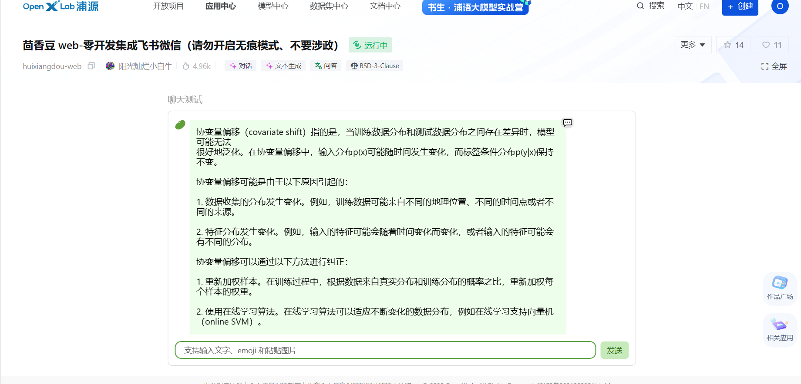
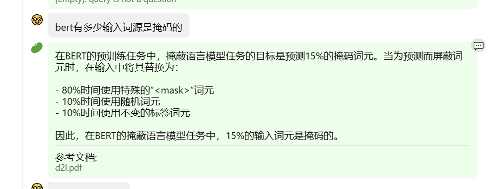
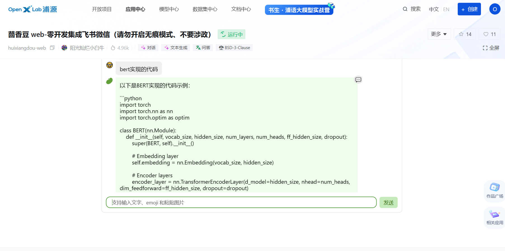
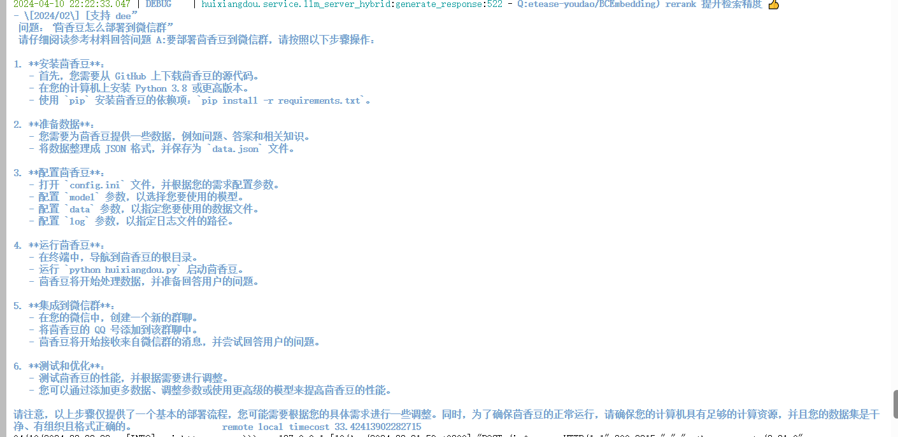
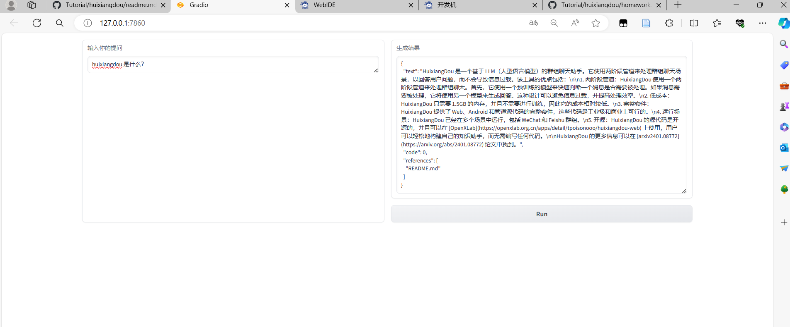

### 1.在[茴香豆 Web 版](https://openxlab.org.cn/apps/detail/tpoisonooo/huixiangdou-web)中创建自己领域的知识问答助手

笔记：[在第三次笔记中](第三次.md)

web：使用的使李沐的《动手学深度学习》中文torch版本，体验下来很强大，连代码都能检索。

### 2.在 `InternLM Studio` 上部署茴香豆技术助手

笔记：[在第三次笔记中](第三次.md)

###  A.InternLM Studio 云端服务器部署

