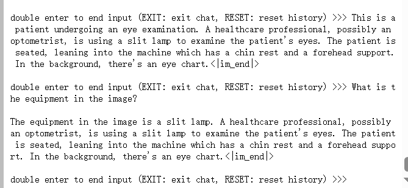

- [训练自己的小助手认知](#训练自己的小助手认知)
- [将自我认知的模型上传到 OpenXLab](#将自我认知的模型上传到-openxlab)
- [复现多模态微调](#复现多模态微调)

### 训练自己的小助手认知

### 将自我认知的模型上传到 OpenXLab

> gradio似乎需要申请，这个过拟合的模型有点不好意思。。。

[mymodel_openxlab](https://openxlab.org.cn/models/detail/fleet/internlm_1.8b/tree/main)

### 复现多模态微调

