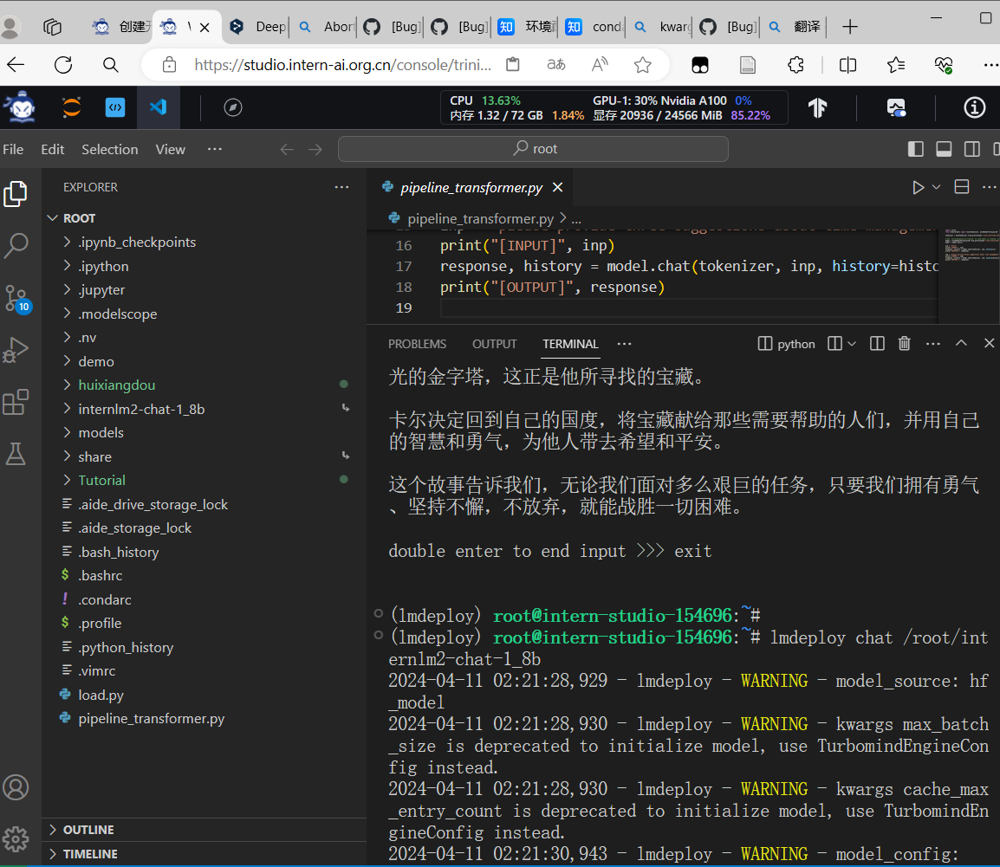
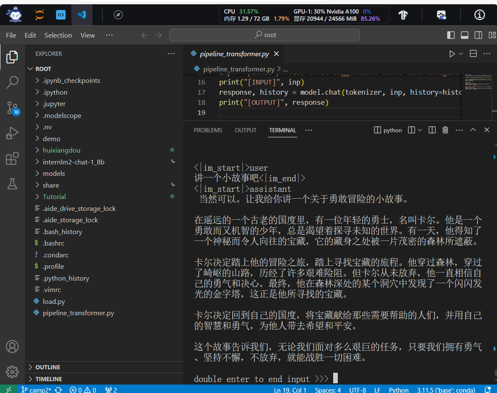
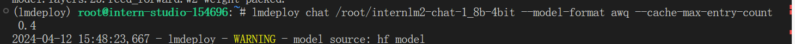
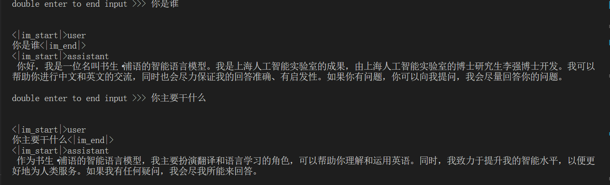
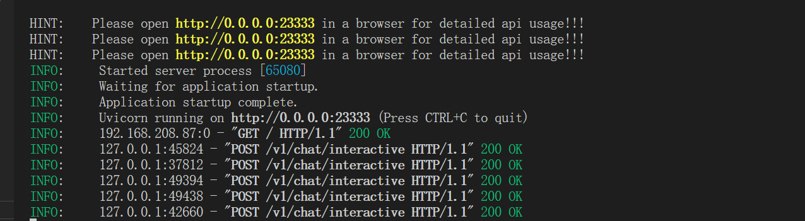
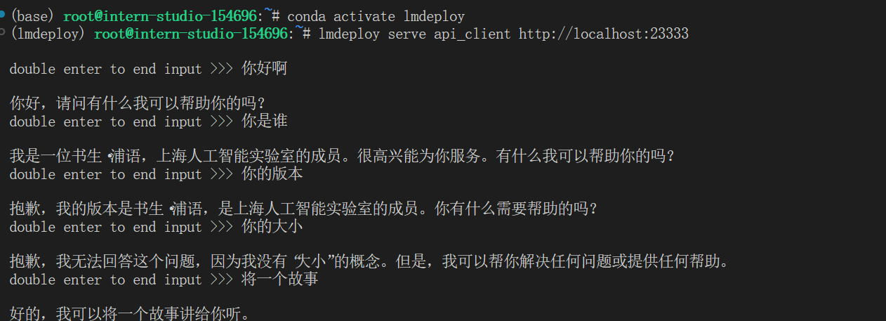
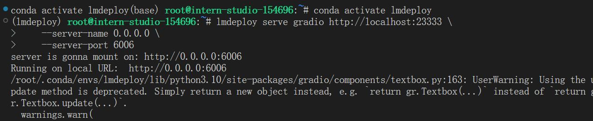
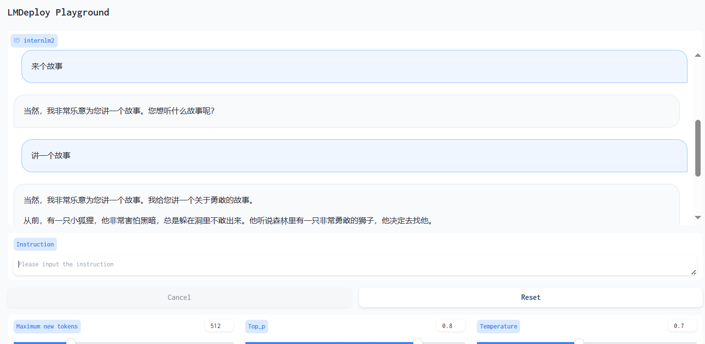
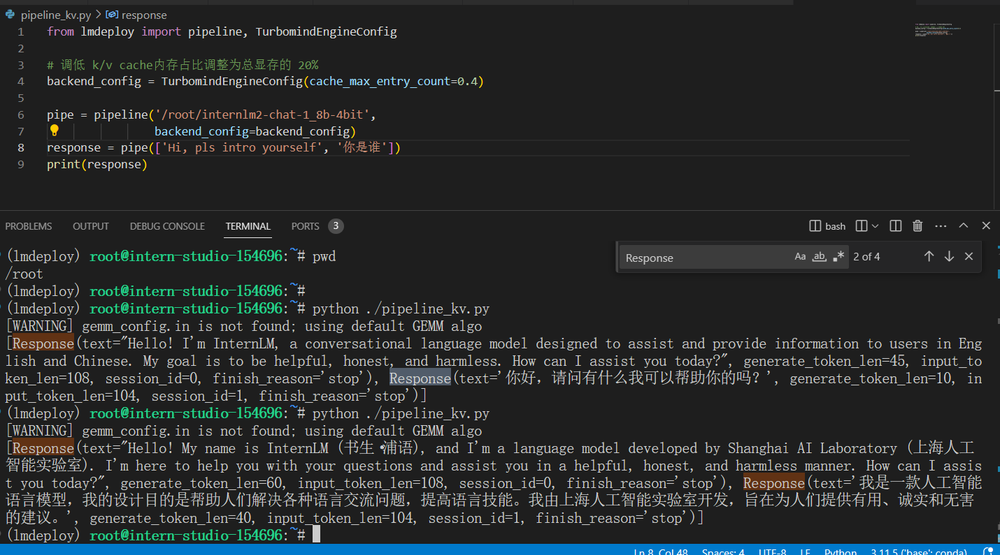
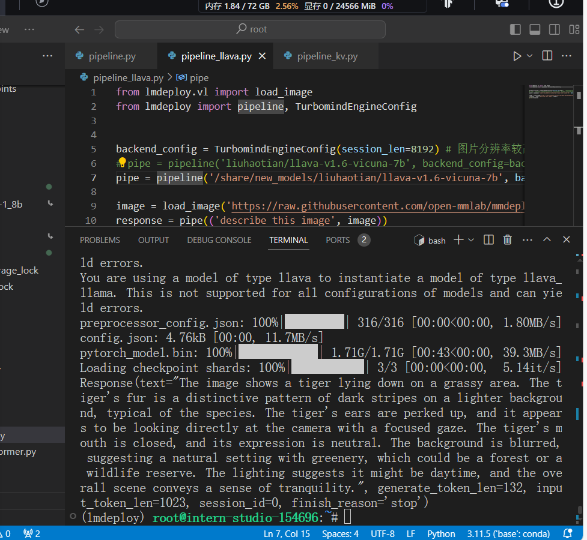

- [基础作业](#基础作业)
- [进阶作业](#进阶作业)
  - [设置KV Cache最大占用比例为0.4，开启W4A16量化，以命令行方式与模型对话](#设置kv-cache最大占用比例为04开启w4a16量化以命令行方式与模型对话)
  - [以API Server方式启动 lmdeploy，开启 W4A16量化，调整KV Cache的占用比例为0.4，分别使用命令行客户端与Gradio网页客户端与模型对话。](#以api-server方式启动-lmdeploy开启-w4a16量化调整kv-cache的占用比例为04分别使用命令行客户端与gradio网页客户端与模型对话)
  - [使用W4A16量化，调整KV Cache的占用比例为0.4，使用Python代码集成的方式运行internlm2-chat-1.8b模型](#使用w4a16量化调整kv-cache的占用比例为04使用python代码集成的方式运行internlm2-chat-18b模型)
  - [使用 LMDeploy 运行视觉多模态大模型 llava gradio demo](#使用-lmdeploy-运行视觉多模态大模型-llava-gradio-demo)
#  基础作业





#  进阶作业

## 设置KV Cache最大占用比例为0.4，开启W4A16量化，以命令行方式与模型对话

```she
lmdeploy chat /root/internlm2-chat-1_8b-4bit --model-format awq
```






## 以API Server方式启动 lmdeploy，开启 W4A16量化，调整KV Cache的占用比例为0.4，分别使用命令行客户端与Gradio网页客户端与模型对话。


```shell
lmdeploy serve api_server \
    /root/internlm2-chat-1_8b-4bit \
    --model-format awq \
    --cache-max-entry-count 0.4 \
    --quant-policy 0 \
    --server-name 0.0.0.0 \
    --server-port 23333 \
    --tp 1
```

后端：



命令行前端：

转发：



html：


## 使用W4A16量化，调整KV Cache的占用比例为0.4，使用Python代码集成的方式运行internlm2-chat-1.8b模型


## 使用 LMDeploy 运行视觉多模态大模型 llava gradio demo

