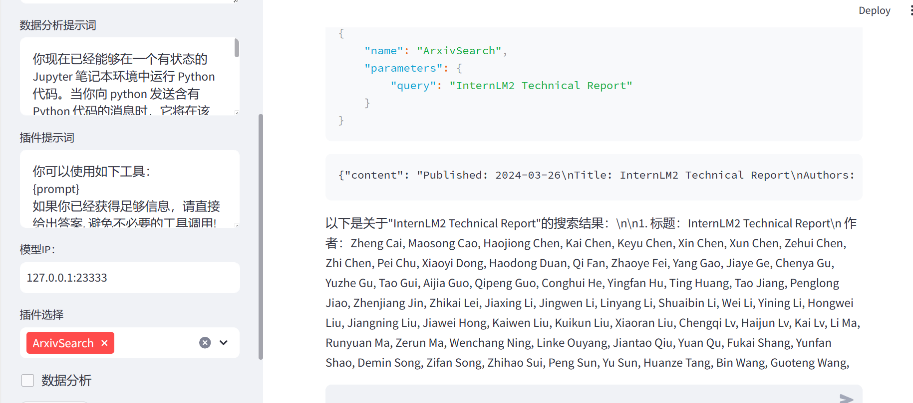
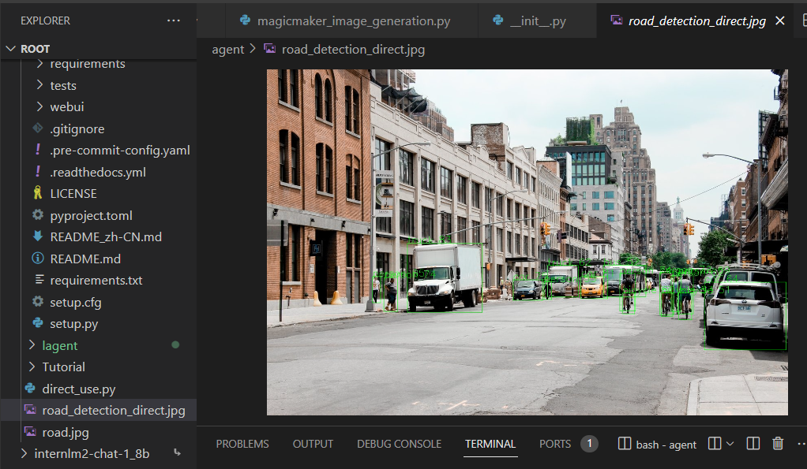
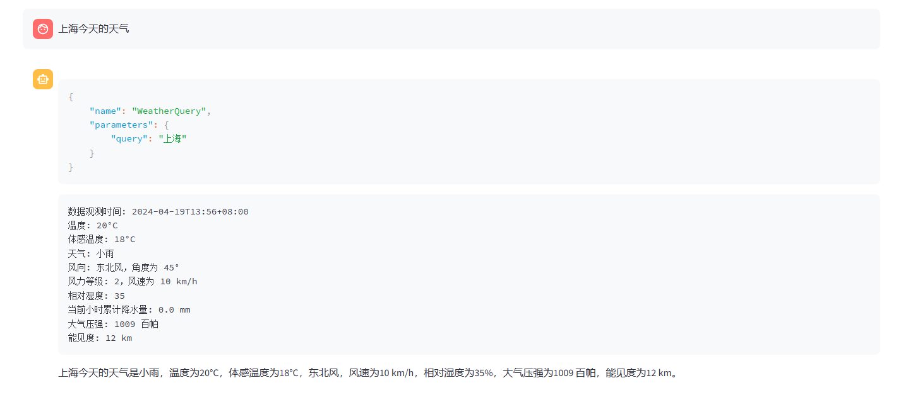
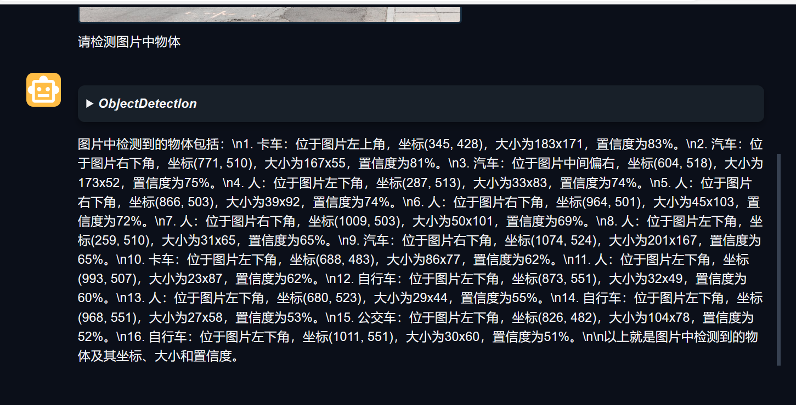
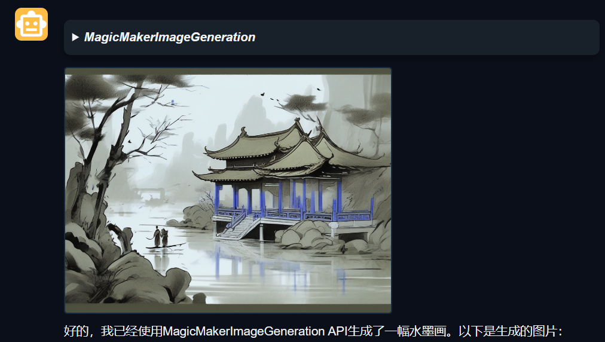
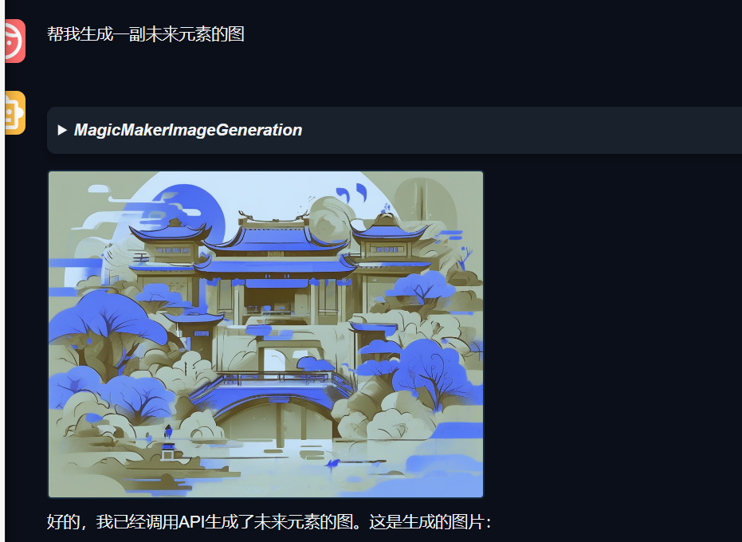

- [1.完成 Lagent Web Demo 使用](#1完成-lagent-web-demo-使用)
- [2.完成 AgentLego 直接使用部分](#2完成-agentlego-直接使用部分)
- [3.完成 AgentLego WebUI 使用](#3完成-agentlego-webui-使用)
- [4.使用 Lagent 或 AgentLego 实现自定义工具并完成调用](#4使用-lagent-或-agentlego-实现自定义工具并完成调用)
### 1.完成 Lagent Web Demo 使用

### 2.完成 AgentLego 直接使用部分

### 3.完成 AgentLego WebUI 使用

### 4.使用 Lagent 或 AgentLego 实现自定义工具并完成调用

magicmakerimagGeneration调用

