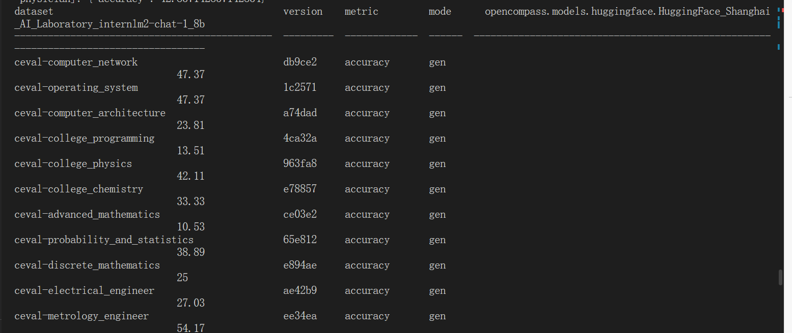
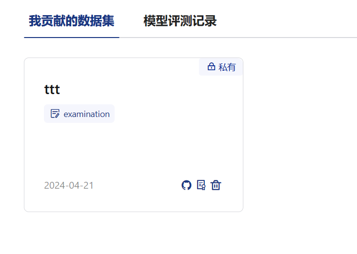

- [使用 OpenCompass 评测 internlm2-chat-1\_8b 模型在 C-Eval 数据集上的性能](#使用-opencompass-评测-internlm2-chat-1_8b-模型在-c-eval-数据集上的性能)
- [将自定义数据集提交至OpenCompass官网](#将自定义数据集提交至opencompass官网)
#### 使用 OpenCompass 评测 internlm2-chat-1_8b 模型在 C-Eval 数据集上的性能

#### 将自定义数据集提交至OpenCompass官网

[readme](README_OPENCOMPASS.md)

