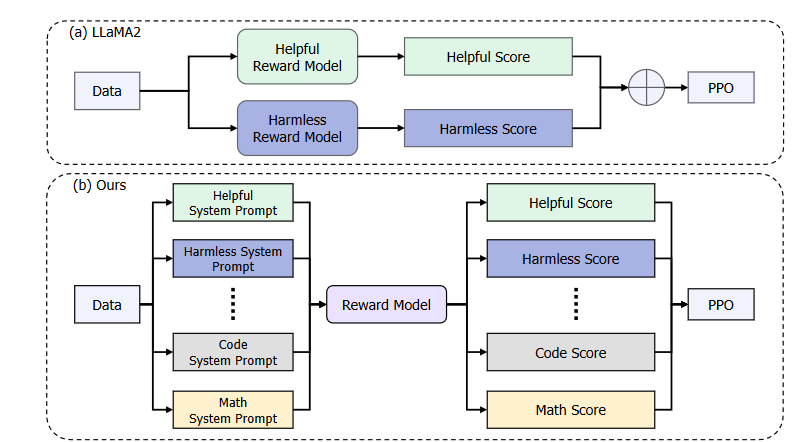

- [课程笔记](#课程笔记)
  - [1.什么是大模型](#1什么是大模型)
  - [2.书生浦语](#2书生浦语)
    - [历史：](#历史)
    - [模型大小](#模型大小)
    - [关于COT（Chain-of-Thought）](#关于cotchain-of-thought)
  - [3.生态链](#3生态链)
    - [应用图](#应用图)
    - [LORA（微调）](#lora微调)
    - [模型评测方案openCompass](#模型评测方案opencompass)
    - [部署（KMDeploy）](#部署kmdeploy)
    - [实用库（AgentLego）](#实用库agentlego)
  - [4.总结](#4总结)
- [技术报告](#技术报告)
  - [1.InternEvo](#1internevo)
  - [2.模型结构](#2模型结构)
  - [3.预训练过程](#3预训练过程)
    - [3.1数据来源](#31数据来源)
    - [3.2预训练设置](#32预训练设置)
    - [3.3训练周期](#33训练周期)
  - [4.对齐阶段](#4对齐阶段)
    - [4.1 监督微调（SFT）](#41-监督微调sft)
    - [4.2 条件在线RLHF（COOL RLHF）](#42-条件在线rlhfcool-rlhf)
    - [4.3长文本微调保持](#43长文本微调保持)
  - [5.评估](#5评估)
    - [5.1下游任务评估](#51下游任务评估)
    - [5.2 对齐性能的评估](#52-对齐性能的评估)
    - [5.3对于数据集污染的评价](#53对于数据集污染的评价)
  - [6.总结](#6总结)
  - [附录](#附录)

# 课程笔记

## 1.什么是大模型

**一个模型能够解决跨模态的任务**

> 关于多模态大模型的发展，自从2021年openai发布了clip模型开始，就开始逐渐打破多模态的壁垒，实现了从图片到文本标签的预测，并且在zero-shot上的效果并不比当时的图片分类sota模型逊色很多，通过ImageNet微调过后的clip甚至能超过一些sota模型。这一种能够处理不同模态的数据，并且通过文本表达多样性，去进行zero-shot的任务部署，似乎越来越成为大模型的主流方向。
>
> zero-shot虽然是一个很有效的一个点，但是很多任务上，他的表现可能不如进行专门数据集微调过后的模型。为了对于特定任务有更好的效果，也可以进行一些参数微调或者是进行强化学习的策略（PPO）进行微调。失去模型一部分的思维广度，来换取在特定任务的更好的效果。

## 2.书生浦语

### 历史：

在发布的一年之中不断提高模型和生态链

**重点：开源！！！！！！！！！！！！**点一下close ai

### 模型大小

推理显存估算：7B-float 是 28 GB，7B-BF16 是 14GB，7B-int8 是 7GB
如果没有训练要求的话在推理的过程中用int8精度是没有太大问题，那么只需要一张显存大于7G的卡就可以进行模型部署了。
微调无脑A100

### 关于COT（Chain-of-Thought）

书生浦语会不会有一些类似于step by step的提示词来提高模型对于任务的理解呢

## 3.生态链

### 应用图

问题：全参数微调和部分参数微调之后的模型差距会很大吗？

一套很完全的体系，对于客户应用

### LORA（微调）

- 在原始 PLM (Pre-trained Language Model) 旁边增加一个旁路，做一个降维再升维的操作，来模拟所谓的`intrinsic rank`。

- 训练的时候固定 PLM 的参数，只训练降维矩阵 X 与升维矩阵  。而模型的输入输出维度不变，输出时将 与 PLM 的参数叠加。

- 用随机高斯分布初始化，用 0 矩阵初始化  ，保证训练的开始此旁路矩阵依然是 0 矩阵

  Lora实际用：

### 模型评测方案openCompass

### 部署（KMDeploy）

有很好的接口，很好的GPU部署方案！

### 实用库（AgentLego）

支持openMMLab

## 4.总结

这是一套很全面的开发链条，可以尝试做一些多模态的人数，比之chatgpt4可能仍存在不足，但是这个模型应该是很支持中文语料库的，很适合国内用户的使用，并且**开源**（close ai）。

# 技术报告

自ChatGPT和GPT-4等模型推出以来，LLMs在学术和工业界中变得极为流行。但是当前的开源模型和现在的GPT比较起来还是存在一定差距。在这种背景下InternLM2应运而生，它不仅开源了模型，而且在关于其他LLM模型不愿提及的**训练数据**上面，也进行了相应分享。

## 1.InternEvo

对于任何一个LLM一个能够训练模型的集群是至关重要的，如何高校展开训练，如何处理容灾问题，都是一个好的LLM所必备的先前条件。InternLM2搭建了InternEvo架构来处理这一问题。

**InternEvo框架**：是一个高效且轻量级的预训练框架，用于模型训练。该框架可以跨数千个GPU扩展模型训练，通过数据、张量、序列和管道并行性结合使用，提高了GPU的内存效率。

InternEvo整合了各种Zero Redundancy Optimizer （借鉴于**deepspeed**）策略，显著降低了训练所需的内存占用。此外，为了提高硬件利用率，采用了FlashAttention技术和混合精度训练。

## 2.模型结构

InternLM2也是采用transformer架构来作为模型骨干结构，在细节设计上基本和**LLaMa2**的结构设计一致，采用了Grouped-Query Attention (GQA)注意力机制来来减小注意力机制中的计算复杂度和内存消耗。还设置了自己的QKV矩阵来加速训练。

## 3.预训练过程

### 3.1数据来源

**文本数据**

**数据处理：**首先对不同来源的数据进行标准化，以获得Format数据。然后，利用启发式统计规则进行数据过滤，得到干净的数据。接下来，采用LSH（Locality-Sensitive Hashing）方法进行重复数据删除，得到Dedup数据。然后，应用复合安全策略来过滤数据，从而产生安全数据。最后对不同来源的数据采取不同的质量过滤策略，获得高质量的预训练数据

**代码数据**包括从GitHub等平台收集的编程相关资料。

### 3.2预训练设置

模型大小以及超参数，由于使用的是GQA所以有两个头参数

**Tokenization**：使用GPT4的词表的6w个和自己的中文词3w个来组成corpus

**优化器：**在训练过程中，使用 AdamW，β1 = 0.9、β2 = 0.95、ε = 1e − 8 和权重衰减 = 0.1 来优化模型。使用余弦学习率衰减，学习率衰减到其最大值的 10%。

### 3.3训练周期

用于预训练1.8B、7B和20B模型的token总数从2.0T到2.6T不等，预训练过程由三个不同的阶段组成。

- 第一阶段，使用长度不超过4k的预训练语料库。

- 在第二阶段，包含了50%的长度不超过32k的预训练语料库。

- 在第三阶段，利用了特定于能力的增强数据。在每个阶段，混合了英文、中文和代码的数据。

  

## 4.对齐阶段

经过预训练的模型**已经**具备了解决各种基本人物的能力和知识，现在需要对模型进行进一步的微调，激发他的能力，让他能够好的**服务于我们的任务**，并且**安全**

通常包含两个阶段：监督微调（SFT）和来自人类反馈的强化学习（RLHF）。

### 4.1 监督微调（SFT）

**数据集**：SFT使用的10百万条指令数据集，这些数据覆盖广泛的主题，旨在训练模型以更准确地响应具体指令和执行多样化的任务。数据集涉及一般对话、NLP任务、解决数学问题、生成代码等领域。

**训练**：将数据样本转换为 ChatML (Cha) 格式。 7B 和 20B 模型均使用 AdamW 优化器进行一个 epoch 的训练，初始学习率为 4e-5。（**1.8B去哪了？**）

### 4.2 条件在线RLHF（COOL RLHF）

**COOL RLHF**：是一个新颖的强化学习策略，旨在解决传统RLHF中偏好冲突的问题。通过条件奖励模型，模型能够根据不同场景动态调整其注意力，以平衡多种人类偏好。

**条件奖励模型**：使用不同的系统提示来指导模型如何根据场景变化响应不同的偏好需求。

**多轮在线RLHF**：通过实施多轮在线RLHF来逐步减少模型的奖励黑客行为，以及结合快速路径（Fast Path）和慢速路径（Slow Path）来持续优化奖励模型。

### 4.3长文本微调保持

在SFT和RLHF中继续使用长上下文预训练数据

**数据获取：**

## 5.评估

使用司南（opencompass）进行模型的评测

### 5.1下游任务评估

**任务：**（1）综合考试，（2）语言和知识，（3）推理和数学，（4）多种编程语言编码，（5）长上下文建模，（6）工具利用。

都有着出色的表现，尤其是在推理和数学评分和长上下文建模很好

### 5.2 对齐性能的评估

**主观评估**：通过英语和中文的主观评估来测试模型的对齐性能，特别是在跟随指令和生成符合人类期望反馈的能力。

**指令遵循评估**：具体分析了模型如何精确遵循复杂指令的能力，这对于实际应用中的可用性至关重要。

**奖励模型削减研究**：通过消融研究来探讨条件奖励模型各部分的贡献，以及这些部分对模型性能的具体影响。

### 5.3对于数据集污染的评价

灰色表示问题较大的数据集

## 6.总结

这份报告提供了一个全面的视角，展示了InternLM2从构想到实现再到评估的全过程。通过开源这一模型，研发团队不仅展示了技术的前沿进展，还为学术界和工业界提供了宝贵的资源，以便进一步的研究和应用开发。

## 附录

讲了关于Internlm的提示词工程
