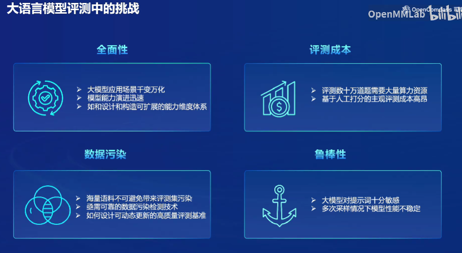
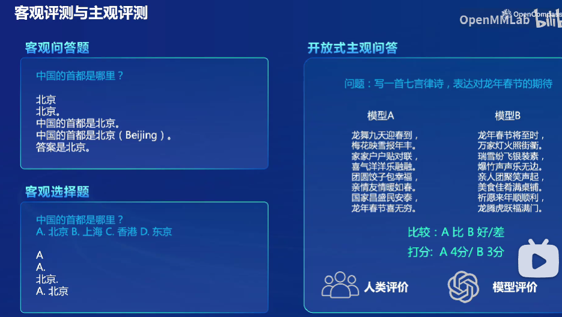
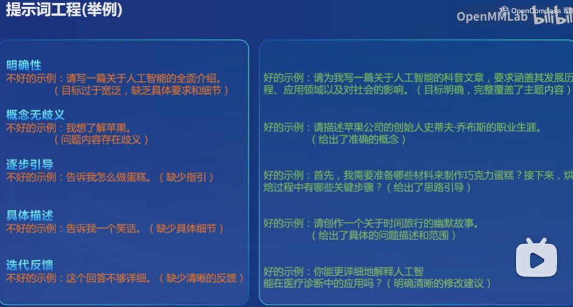
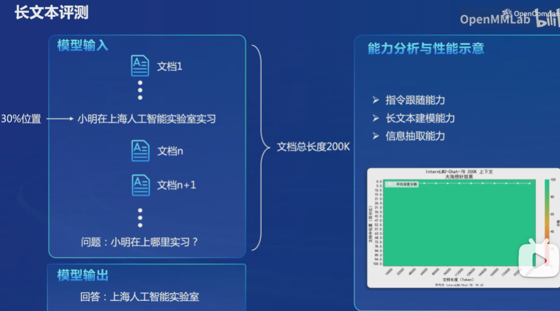
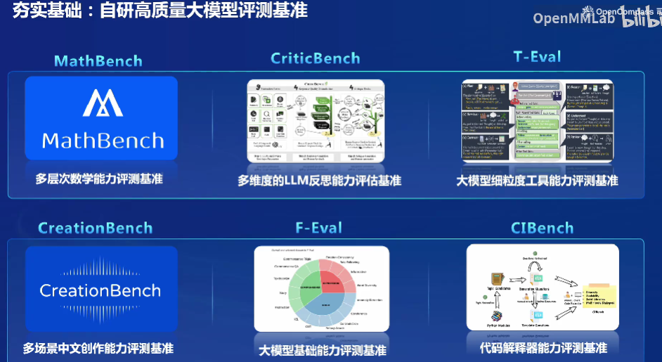

# opencompass

## 1.大模型的评测

随着LLM模型的迅速发展，市面上的大模型更新迭代愈发频繁，如何评价一个大模型的能力是一个很关键的问题。

对于大模型的评测的有以下四个挑战：

- 全面性：需要一个有效可拓展的评测体系
- 评测成本：成本昂贵
- 数据污染：数据污染的检测机制
- 鲁棒性：对提示词敏感，多次采样结果不同

## 2.opencompass

 **OpenCompass** 是一个开源开放的大模型评测平台，旨在全面评估大型语言模型（LLMs）的能力。它构建了一个包含学科、语言、知识、理解、推理等五大维度的通用能力评测体系，支持超过 50 个评测数据集和 30 万道评测题目。OpenCompass 还支持零样本、小样本和思维链评测，是目前最全面的开源评测平台
[opencompass](https://opencompass.org.cn/)

### 2.1opencompass如何评测

**支持基座模型和对话模型不同的评测**

**支持本地模型和API模型评测**

#### 2.1.1客观评测和主观评测

- 客观评测：
  - 客观问答题评测
  - 客观选择题评测
- 主观评测：通过主观问题的方式生成不同模型的不同结果，通过比较或者打分的方式评价（评价者可以是人类也可以是GPT4）

#### 2.2.2提示词工程

对于提示词有着一个好坏的评价标准，对于复杂问题有这思维链的提示词COT。

#### 2.2.3 长文本评测

对于一个长文本，在其中插入毫不相关的一句话，询问模型这个不相关的一句话，评测模型的”**大海捞针**“能力

### 2.2 compasskit

支持数据污染检查和中英语双语评测

自研高质量大模型评测，提出自己的评测基准来应对各种情况。

## **Appendix**

**二维码**