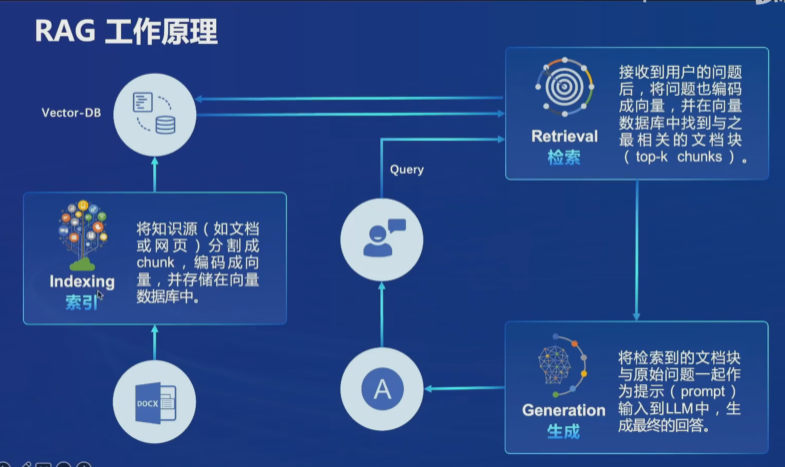
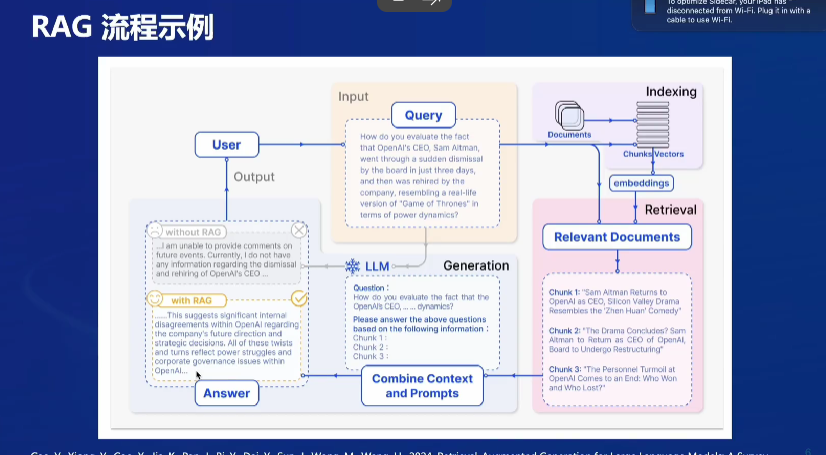
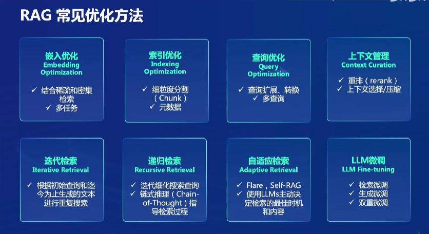
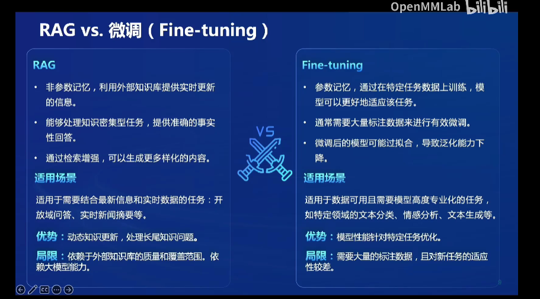
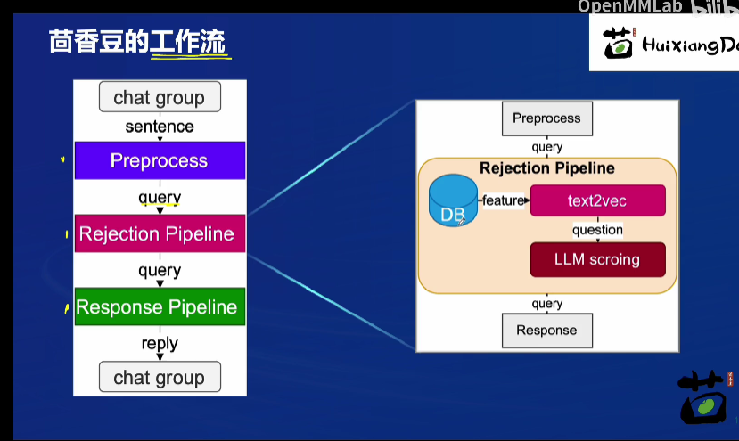

- [RAG](#rag)
  - [1.RAG技术](#1rag技术)
  - [2.RAG工作](#2rag工作)
  - [3.RAG优化方法](#3rag优化方法)
  - [4.RAG VS 微调](#4rag-vs-微调)
- [茴香豆](#茴香豆)
  - [茴香豆文件结构](#茴香豆文件结构)
    - [3.5 文件结构](#35-文件结构)

# RAG

## 1.RAG技术

> RAG通过检索获取相关知识并将其融入Prompt，使大模型能够参考这些知识生成合理的回答，其中核心是**检索**和**生成**。
> 1. **检索**：利用向量数据库高效存储和检索能力，召回目标知识。
> 2. **生成**：利用大模型和Prompt工程，将召回的知识合理利用，生成目标答案

## 2.RAG工作



>1. ###### **数据拆分和向量化**：
>
>   - 首先，将文本数据切分成小段，例如句子或段落。
>   - 利用某种Transformer编码器模型，将这些文本段转换成向量形式。
>
>2. **构建向量索引**：
>
>   - 将所有文本段的向量汇集到一个索引中。这个索引代表了我们文档的内容。
>
>3. **查询和检索**：
>
>   - 当用户提出问题或请求时，RAG会使用同一个编码器模型将用户的查询转换成向量。
>   - 根据这个向量在索引中进行搜索，找到最相关的前k个结果。
>   - 从数据库中提取相应的文本段作为上下文信息。
>
>4. **生成答案**：
>
>   - 将检索到的文本段作为背景上下文，与用户的查询一起输入到大型语言模型中。
>   - 大语言模型根据整合后的提示生成合理的回答。
>
>   cite：[深度好文！最全的大模型 RAG 技术概览 - 知乎 (zhihu.com)](https://zhuanlan.zhihu.com/p/678893732)



![image-20240410005044296](C:/Users/一曲流年/AppData/Roaming/Typora/typora-user-images/image-20240410005044296.png

## 3.RAG优化方法



> - 嵌入优化和索引优化是对于向量数据库的优化。
> - 查询优化和上下文管理是用于优化用户的问题，让用户的问题更好被理解。
> - 不同检索方式也对于RAG模型的影响很大
> - LLM微调是针对于语言模型的优化

## 4.RAG VS 微调



> RAG优点在于不用训练大预言模型，很容易部署，知识库不需要标注获取难度小，缺点是十分依赖知识库和LLM模型质量
>
> Fine-tuning优点在可以用于更复杂的下游任务，缺点数据需要标注

# 茴香豆

>**茴香豆**是一个基于大型语言模型（LLM）的群聊领域知识助手，由书生浦语团队开发的开源项目。它专为群聊场景优化，提供即时准确的技术支持和自动化问答服务。

>**茴香豆的特点**：
>
>- **群聊场景优化**：茴香豆专为群聊中的技术支持而设计，解决了消息泛滥的问题。
>- **零代码搭建**：使用茴香豆，你可以快速搭建自己的领域知识助手，无需编写复杂的代码。
>- **成本低**：茴香豆的显存占用低至1.5GB，适用于各行业。



> 茴香豆对于输入的问题，首先会根据自身的评判标准判断问题好坏，选择回答好的问题然后在进行正常RAG流程。

## 茴香豆文件结构

### 3.5 文件结构

茴香豆文件

```
.
├── LICENSE
├── README.md
├── README_zh.md
├── android
├── app.py
├── config-2G.ini
├── config-advanced.ini
├── config-experience.ini
├── config.ini # 配置文件
├── docs # 教学文档
├── huixiangdou # 存放茴香豆主要代码，重点学习
├── huixiangdou-inside.md
├── logs
├── repodir # 默认存放个人数据库原始文件，用户建立
├── requirements-lark-group.txt
├── requirements.txt
├── resource
├── setup.py
├── tests # 单元测试
├── web # 存放茴香豆 Web 版代码
└── web.log
└── workdir # 默认存放茴香豆本地向量数据库，用户建立
```


```
./huixiangdou
├── __init__.py
├── frontend # 存放茴香豆前端与用户端和通讯软件交互代码
│   ├── __init__.py
│   ├── lark.py
│   └── lark_group.py
├── main.py # 运行主贷
├── service # 存放茴香豆后端工作流代码
│   ├── __init__.py
│   ├── config.py #
│   ├── feature_store.py # 数据嵌入、特征提取代码
│   ├── file_operation.py
│   ├── helper.py
│   ├── llm_client.py
│   ├── llm_server_hybrid.py # 混合模型代码
│   ├── retriever.py # 检索模块代码
│   ├── sg_search.py # 增强搜索，图检索代码
│   ├── web_search.py # 网页搜索代码
│   └── worker.py # 主流程代码
└── version.py
```


茴香豆工作流中用到的 **Prompt** 位于 `huixiangdou/service/worker.py` 中。可以根据业务需求尝试调整 **Prompt**，打造你独有的茴香豆知识助手。

```
...
        # Switch languages according to the scenario.
        if self.language == 'zh':
            self.TOPIC_TEMPLATE = '告诉我这句话的主题，直接说主题不要解释：“{}”'
            self.SCORING_QUESTION_TEMPLTE = '“{}”\n请仔细阅读以上内容，判断句子是否是个有主题的疑问句，结果用 0～10 表示。直接提供得分不要解释。\n判断标准：有主语谓语宾语并且是疑问句得 10 分；缺少主谓宾扣分；陈述句直接得 0 分；不是疑问句直接得 0 分。直接提供得分不要解释。'  # noqa E501
            self.SCORING_RELAVANCE_TEMPLATE = '问题：“{}”\n材料：“{}”\n请仔细阅读以上内容，判断问题和材料的关联度，用0～10表示。判断标准：非常相关得 10 分；完全没关联得 0 分。直接提供得分不要解释。\n'  # noqa E501
            self.KEYWORDS_TEMPLATE = '谷歌搜索是一个通用搜索引擎，可用于访问互联网、查询百科知识、了解时事新闻等。搜索参数类型 string， 内容是短语或关键字，以空格分隔。\n你现在是{}交流群里的技术助手，用户问“{}”，你打算通过谷歌搜索查询相关资料，请提供用于搜索的关键字或短语，不要解释直接给出关键字或短语。'  # noqa E501
            self.SECURITY_TEMAPLTE = '判断以下句子是否涉及政治、辱骂、色情、恐暴、宗教、网络暴力、种族歧视等违禁内容，结果用 0～10 表示，不要解释直接给出得分。判断标准：涉其中任一问题直接得 10 分；完全不涉及得 0 分。直接给得分不要解释：“{}”'  # noqa E501
            self.PERPLESITY_TEMPLATE = '“question:{} answer:{}”\n阅读以上对话，answer 是否在表达自己不知道，回答越全面得分越少，用0～10表示，不要解释直接给出得分。\n判断标准：准确回答问题得 0 分；答案详尽得 1 分；知道部分答案但有不确定信息得 8 分；知道小部分答案但推荐求助其他人得 9 分；不知道任何答案直接推荐求助别人得 10 分。直接打分不要解释。'  # noqa E501
            self.SUMMARIZE_TEMPLATE = '{} \n 仔细阅读以上内容，总结得简短有力点'  # noqa E501
            # self.GENERATE_TEMPLATE = '材料：“{}”\n 问题：“{}” \n 请仔细阅读参考材料回答问题，材料可能和问题无关。如果材料和问题无关，尝试用你自己的理解来回答问题。如果无法确定答案，直接回答不知道。'  # noqa E501
            self.GENERATE_TEMPLATE = '材料：“{}”\n 问题：“{}” \n 请仔细阅读参考材料回答问题。'  # noqa E501
...
```
