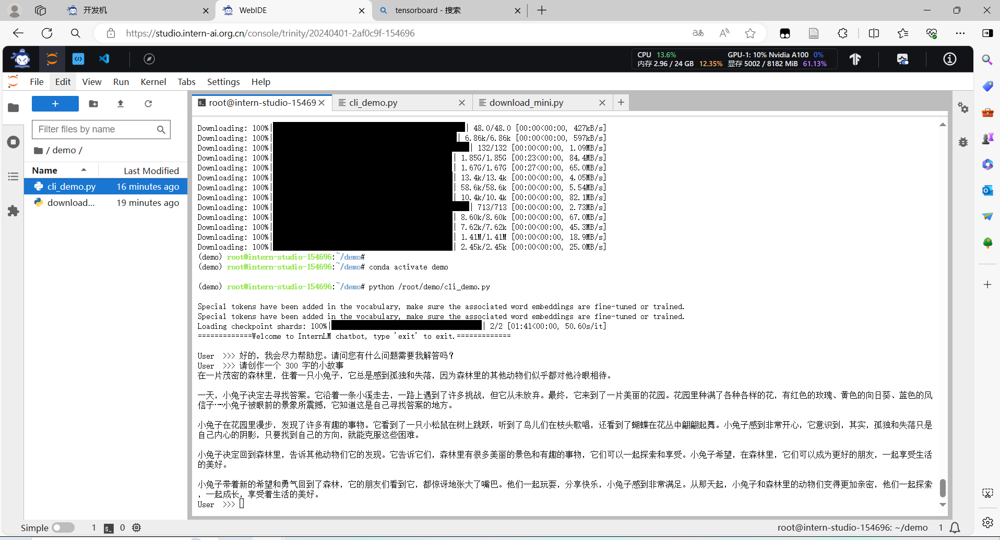
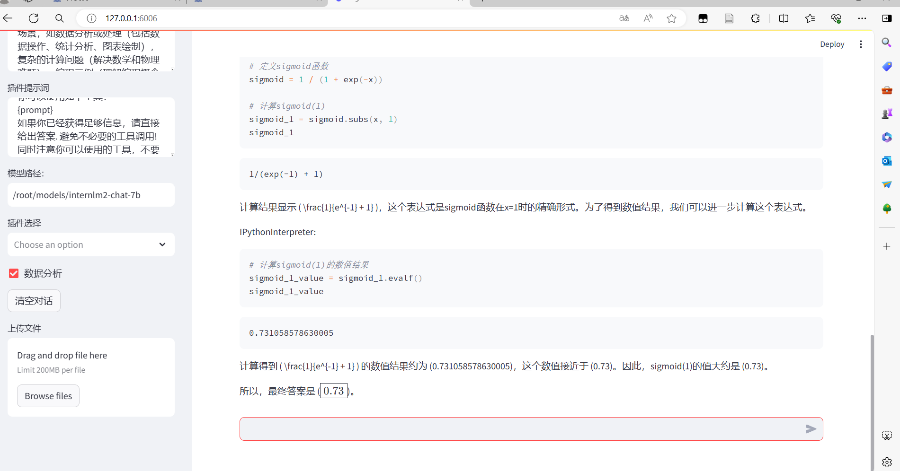

目录：
- [demo1：InternLM2-Chat-1.8B](#demo1internlm2-chat-18b)
- [demo2：八戒-Chat-1.8B](#demo2八戒-chat-18b)
- [demo3：**Lagent**](#demo3lagent)
- [demo4：浦语·灵笔2](#demo4浦语灵笔2)
- [附录](#附录)
  - [换源下载：](#换源下载)
  - [模型下载：](#模型下载)
    - [1.**Hugging Face**](#1hugging-face)
    - [2.**ModelScope**](#2modelscope)
    - [3 **OpenXLab**](#3-openxlab)
    - [**软链接清除方法**](#软链接清除方法)
- [大图片](#大图片)

# demo1：InternLM2-Chat-1.8B

- 创建开发机器，使用cuda11.7镜像

- 用以下指令创建demo环境

  ```
  studio-conda -o internlm-base -t demo
  ```

- 进入环境安装必备的包- 

- 用touch创建.py文件

  ``` 
  mkdir -p /root/demo
  touch /root/demo/cli_demo.py
  touch /root/demo/download_mini.py
  cd /root/demo
  ```

- 复制模型下载代码（魔搭下载），定义模型运行文件，添加promt。

- 运行模型



# demo2：八戒-Chat-1.8B

步骤基本和上述一样，转发远端的127.0.0.1:6006端口到本地6006端口，以实现本地访问

```
ssh -CNg -L 6006:127.0.0.1:6006 root@ssh.intern-ai.org.cn -p 38374
```

# demo3：**Lagent**

Lagent 是一个轻量级、开源的基于大语言模型的智能体（agent）框架，支持用户快速地将一个大语言模型转变为多种类型的智能体，并提供了一些典型工具为大语言模型赋能。它的整个框架图如下:


- 使用share目录下的7B聊天模型作为Lagent的LLM模型
- 运行demo
- 转发端口
- 本地交互



# demo4：浦语·灵笔2

终于体验了一下浦语·灵笔2,但是呢发现他的创造性是基于随机种子的设置的，这一点就很疑惑了，这个随机种子是什么，为什么能够调控模型的生成，而且达到每一次相同的输入相同的随机种子就能达到一样的生成，那么这个图片生成器是如何制作的，就令人很感兴趣了。
[seed=8909生成图](#1)   [seed=7201生成图](#22) 

其次可能有一些图片生成会出现很奇怪的图片，这个应该是模型大小选用的不够大，最大的模型效果应该会好很多
[水墨画生成油画](#3) 

最后就是关于图片理解，可能是我的派大星太奇怪啦[派大星理解成海绵宝宝啦](#4) 


# 附录

## 换源下载：

```ubuntu
python -m pip install --upgrade pip
pip config set global.index-url   https://mirrors.cernet.edu.cn/pypi/web/simple
###pip换源

对于 conda 换源，镜像站提供了 Anaconda 仓库与第三方源（conda-forge、msys2、pytorch 等），各系统都可以通过修改用户目录下的 .condarc 文件来使用镜像站。不同系统下的 .condarc 目录如下
```

## 模型下载：

### 1.**Hugging Face**

``` python
pip install -U huggingface_hub
import os
# 下载模型
os.system('huggingface-cli download --resume-download internlm/internlm2-chat-7b --local-dir your_path')

#部分下载import os 
from huggingface_hub import hf_hub_download  # Load model directly 

hf_hub_download(repo_id="internlm/internlm2-7b", filename="config.json")
```

### 2.**ModelScope**

```python
pip install modelscope==1.9.5
pip install transformers==4.35.2
import torch
from modelscope import snapshot_download, AutoModel, AutoTokenizer
import os
model_dir = snapshot_download('Shanghai_AI_Laboratory/internlm2-chat-7b', cache_dir='your path', revision='master')
```

### 3 **OpenXLab**

```
import torch
import os
from transformers import AutoModelForCausalLM, AutoTokenizer, AutoModel
base_path = './local_files'
os.system('apt install git')
os.system('apt install git-lfs')
os.system(f'git clone https://code.openxlab.org.cn/Usr_name/repo_name.git {base_path}')
os.system(f'cd {base_path} && git lfs pull')
```

### **软链接清除方法**

**` unlink link_name`**

```
cd /root/demo/
unlink internlm2-chat-7b
```

# 大图片


