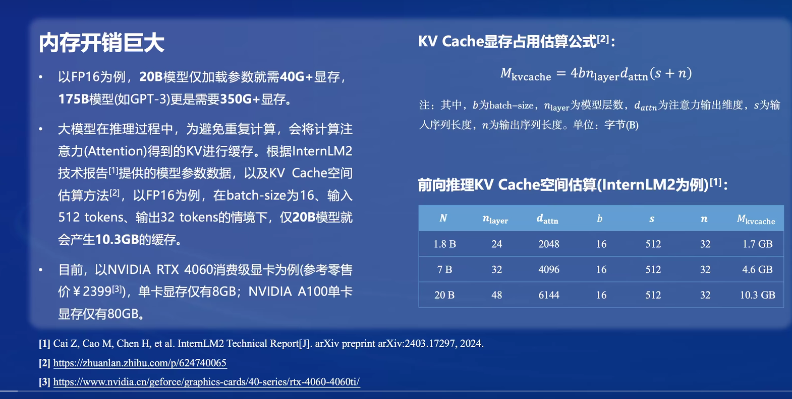
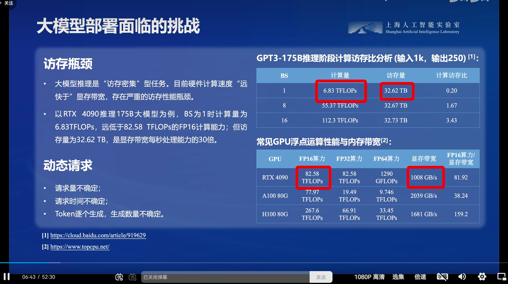
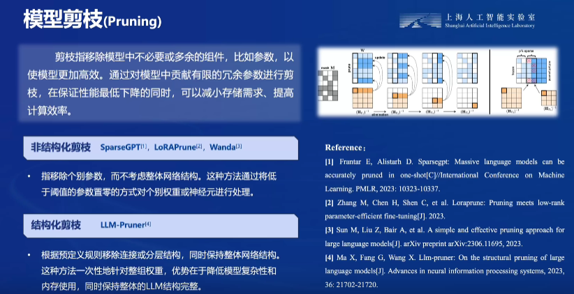
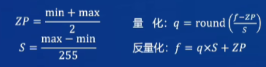
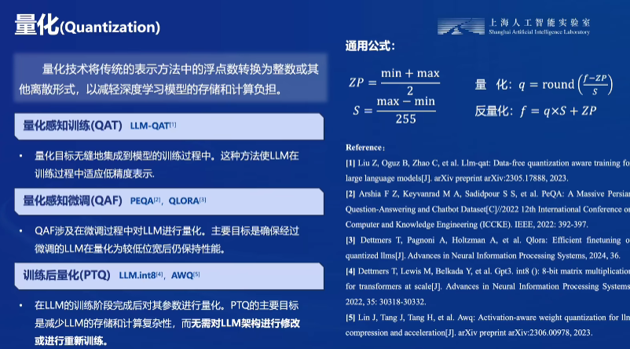
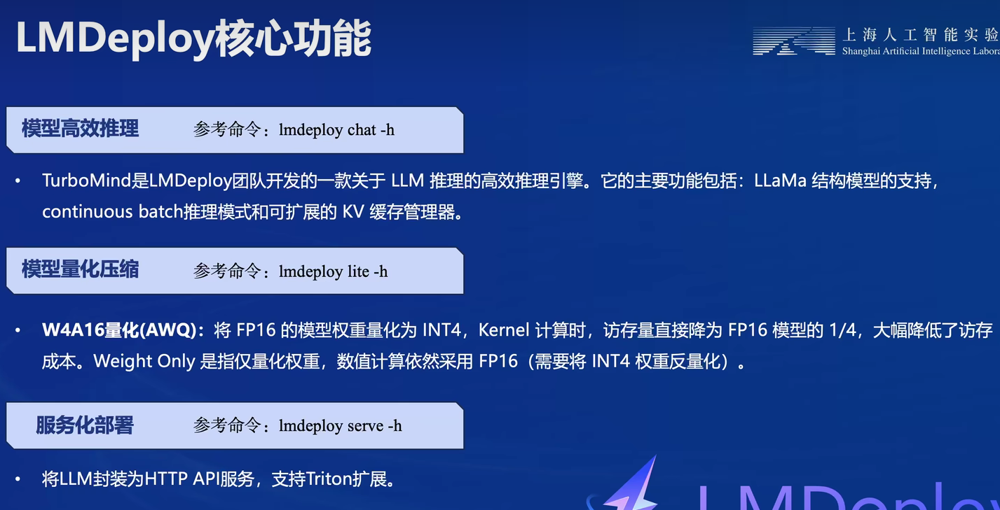
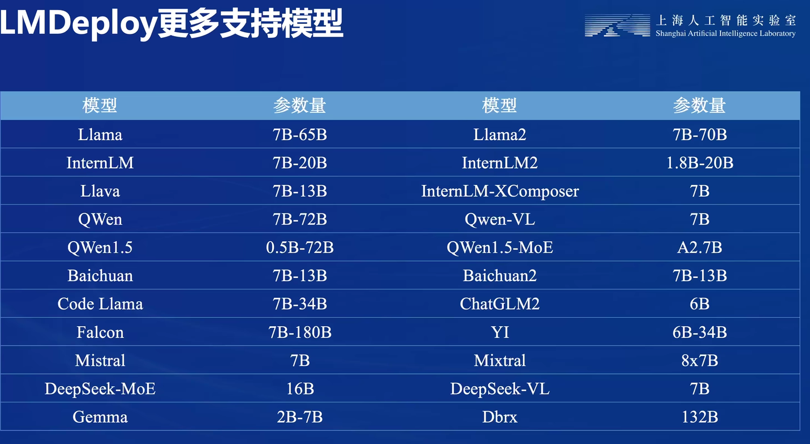

- [1.大模型挑战](#1大模型挑战)
- [2.大模型部署方法](#2大模型部署方法)
    - [2.1模型剪枝](#21模型剪枝)
    - [2.2知识蒸馏](#22知识蒸馏)
    - [2.3量化](#23量化)
- [3.LMDploy](#3lmdploy)
# 1.大模型挑战

现在计算机算力的发展迅速，但是我们一般能够使用的显卡显存并不是很大（消费级最大24G，专业级最大80G，虽然Google的TPU能够实现更大的显存，但是这种设备一般是拿不到的）。

大模型本身的参数量就很大，仅仅加载参数需要很大的显存，况且一般大LLM大模型都是使用transformer decoder架构实现的，为了减少重复运算，一般会把KV进行缓存下来，这就导致显存的空间岌岌可危。

访存问题：目前的大模型基于基本的transformer库的访存量和计算量与当前GPU的算力和带宽不成比例，访存需求远大于计算需求。

动态请求：大型模型的请求数量不固定，而且Token逐个生成，数量也不定。

# 2.大模型部署方法

### 2.1模型剪枝

模型剪枝，也称为模型稀疏化，与模型量化不同，它直接“删除”模型中的一部分权重参数。其原理是通过剔除模型中“不重要”的权重，减少参数量和计算量，同时尽量保证模型的精度不受影响。

1. **非结构化剪枝**：
   - 针对每个参数进行选择性的剪枝，不考虑网络的特定结构或模式。
   - 首先，训练一个完整的模型，然后再根据设置的剪枝率来选择保留每个矩阵中最重要的参数。
   - 简而言之，剪的是参数，而非通道（channel）和卷积核。
2. **结构化剪枝**：
   - 针对整体的网络结构进行考虑，而不是独立地对每个参数进行剪枝。
   - 结构化剪枝可以分为不同粒度：
     - **层级级别**：整个网络层级的剪枝，例如删除某一层的全部节点。
     - **通道级别**：对某一层的通道（channel）进行剪枝，即删除整个通道。
     - **滤波器级别**：在卷积层中，删除整个滤波器（filter）

### 2.2知识蒸馏

**知识蒸馏**是一种模型压缩方法，基于“教师-学生网络思想”，在工业界被广泛应用。它的理论基础来自于2015年Hinton发表的论文《Knowledge Distillation》（简称KD）。

> 在深度学习中，大型模型通常具有庞大的参数数量，难以部署到资源受限的环境中。知识蒸馏的目标是将已经训练好的模型所包含的知识“蒸馏”提取到另一个模型中，以实现模型压缩。
>
> - **教师模型（Teacher Model）**：通常是一个复杂的大型模型，也可以由多个模型集成而成。它在训练过程中用作知识提供者。
> - **学生模型（Student Model）**：是一个轻量化的小型模型，用于接收教师模型的知识。

### 2.3量化

量化是指将大型语言模型从其原始浮点数表示转换为更小的表示，以减小模型的大小和计算复杂度。

**量化计算过程**：

量化是将数值映射到有限集合的过程，通常用于将浮点数转换为定点数。在深度学习中，模型量化是一种有效的模型压缩方法，可以减小模型的大小、加速计算，并降低存储和功耗。

- 对称量化

- 非对称量化

  量化公式： 

  $q(x)=round(\frac{X−X_{zero\_point}}{scale})$

  反量化公式： 

  $x(q)=q⋅scale+X_{zero\_point}$

  ￥

# 3.LMDploy

**LMDeploy** 是一个由 MMRazor 和 MMDeploy 团队开发的工具包，用于压缩、部署和提供大型语言模型（LLMs）的服务。它的目标是简化大型模型的部署流程，优化推理速度，并提供便捷的 RESTful API 接口

**TurboMind**是LMDeploy团队开发的一款关于LLM推理的高效推理引擎，它的主要功能包括：LLaMa 结构模型的支持，continuous batch 推理模式和可扩展的 KV 缓存管理器。

TurboMind推理引擎仅支持推理TurboMind格式的模型。因此，TurboMind在推理HF格式的模型时，会首先自动将HF格式模型转换为TurboMind格式的模型。**该过程在新版本的LMDeploy中是自动进行的，无需用户操作。**

几个容易迷惑的点：

- TurboMind与LMDeploy的关系：LMDeploy是涵盖了LLM 任务全套轻量化、部署和服务解决方案的集成功能包，TurboMind是LMDeploy的一个推理引擎，是一个子模块。LMDeploy也可以使用pytorch作为推理引擎。
- TurboMind与TurboMind模型的关系：TurboMind是推理引擎的名字，TurboMind模型是一种模型存储格式，TurboMind引擎只能推理TurboMind格式的模型。

[学习文档](https://github.com/InternLM/Tutorial/blob/camp2/lmdeploy/README.md#turbomind)