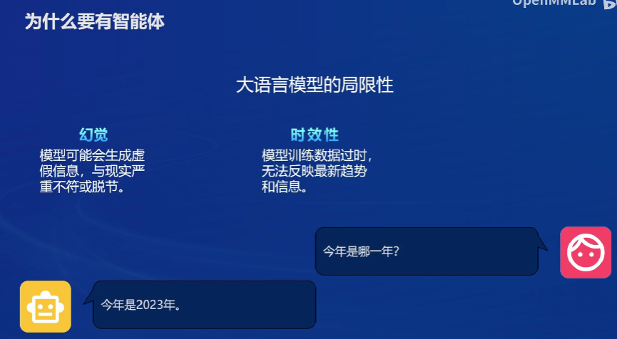

# Lagent
- [Lagent](#lagent)
  - [1.智能体](#1智能体)
    - [1.1大预言模型的局限性](#11大预言模型的局限性)
    - [1.2什么是智能体](#12什么是智能体)
    - [1.3智能体的组成](#13智能体的组成)
  - [2.LLM中的智能体](#2llm中的智能体)
    - [2.1autogpt](#21autogpt)
    - [2.2ReWoo](#22rewoo)
    - [2.3ReAct](#23react)
    - [2.4.Lagent](#24lagent)
  - [3.搭建](#3搭建)

## 1.智能体

### 1.1大预言模型的局限性

> **幻觉:**模型可能会生成虚假信息，与现实严重不符或脱节。
> **时效性:**模型训练数据过时无法反映最新趋势和信息。

### 1.2什么是智能体

> **智能体**是指驻留在某一环境下，能持续自主地发挥作用，具备驻留性、反应性、社会性、主动性等特征的计算实体。
>
> [智能体 - MBA智库百科 (mbalib.com)](https://wiki.mbalib.com/wiki/智能体)

### 1.3智能体的组成

> 1. **感知（Perception）**：智能体能够通过感知器（如传感器、摄像头、或接收数据输入的接口）来观察和接收环境中的信息。这允许智能体获取关于其所处环境的实时数据。
> 2. **决策（Decision Making）**：基于收集到的信息，智能体需要处理和评估数据，做出决策。这通常涉及一定的推理或学习过程，以确定如何有效地响应或改变环境以达到其目标。
> 3. **行动（Action）**：智能体能够通过行为器（如机械臂、输出信号、或发送指令等）对环境进行干预。行动是基于智能体的决策过程，并旨在推动智能体向其目标前进。

## 2.LLM中的智能体

### 2.1autogpt

> **Auto-GPT** 是一个基于 GPT-4 构建的开源 Python 应用程序,它的核心思想是实现自动执行任务，而无需提供多个提示。
>
> **工作原理**：用户提供一个目标性的提示后，Auto-GPT 将会执行下图一系列步骤来实现最终目标。

### 2.2ReWoo

> **ReWOO** 是一种用于增强语言模型（ALM）的新型提示范式，旨在将大型语言模型（LLM）的推理能力与允许进行知识检索和执行操作的工具相结合
>
> **ReWOO** 将 ALM 的关键组件（逐步推理、工具调用和总结）分为三个独立的模块：Planner、Worker 和 Solver。Planner 对任务进行拆分并制定相互依赖的计划蓝图，Worker 负责执行计划，而 Solver 则负责总结结果
>
> https://ar5iv.labs.arxiv.org/html/2305.18323

### 2.3ReAct

> **ReAct**（Reason and Act）：ReAct 是一种范式，通过多次调用 LLM 以交错的方式生成推理轨迹和特定于任务的动作，从而实现推理和行动之间的协同作用。推理轨迹帮助模型归纳、跟踪和更新行动计划以及处理异常，而操作允许它与外部源（例如知识库或外部环境、API）交互，以收集附加信息
>
> [csdn](https://blog.csdn.net/hjingfeng/article/details/136419072)

### 2.4.Lagent

**Lagent** 是一个轻量级的开源框架，专门用于构建基于大型语言模型（LLM）的代理（Agents），架构图如下

**Agentlego**是一个工具包，可以自定义智能体，同时提供了很多前沿算法作为demo智能体。

**关系**：lagent有三个任务调用工具，工具功能支持，工具输出，二agentlego实现的是工具功能支持的自定义任务。

## 3.搭建

首先使用了lagent的简单搭建了一个天气查询功能的agent，其中值得注意的是lagent自定义工具的设置主要分为以下三部

>1. 继承 BaseAction 类
>2. 实现简单工具的 run 方法；或者实现工具包内每个子工具的功能
>3. 简单工具的 run 方法可选被 tool_api 装饰；工具包内每个子工具的功能都需要被 tool_api 装饰

然后就是agentlego搭建目标检测工具值得主页的也是工具定义

> 1. 继承 BaseTool 类
> 2. 修改 default_desc 属性（工具功能描述）
> 3. 如有需要，重载 setup 方法（重型模块延迟加载）
> 4. 重载 apply 方法（工具功能实现）
>
> 其中第一二四步是必须的步骤。下面我们将实现一个调用 MagicMaker 的 API 以实现图像生成的工具。

