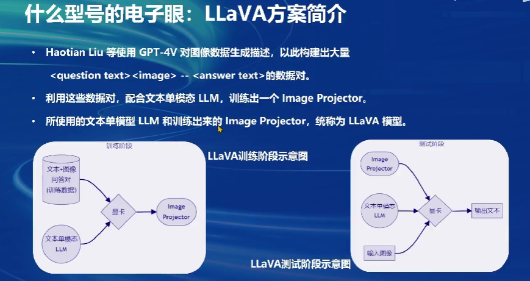

# Xtuner
- [Xtuner](#xtuner)
  - [1.微调](#1微调)
    - [增量预训练微调](#增量预训练微调)
    - [指令跟随微调](#指令跟随微调)
  - [2.数据处理](#2数据处理)
  - 
  - [3.微调方法](#3微调方法)
  - [4.Xtuner](#4xtuner)
  - [5.多模态LLM](#5多模态llm)

## 1.微调

### 增量预训练微调

增量预训练微调是一种训练方法，其中在预训练的基础上对模型进行进一步的训练，以使其更好地适应特定的任务或数据集。这种方法的关键在于，模型已经有了一个广泛的知识基础（通过大规模的预训练获得），而增量微调则是在此基础上增加更多特定领域的知识。例如，一个在通用文本上预训练的语言模型可能会在医疗文本上进行增量微调，以提高其在医疗领域的表现。这种微调通常涉及在预训练模型上使用少量的领域特定数据进行额外训练。

### 指令跟随微调

指令跟随微调是指训练模型以更好地理解和遵循用户给出的指令。这种类型的微调专注于提升模型对指令性语言的理解能力，使其能够根据指令执行具体的任务。在这种情况下，训练数据通常包含一系列指令以及期望的输出或行为。模型通过学习这些指令和相应的响应，来优化其执行具体指令的能力。

## 2.数据处理

下图表示了LLM模型对于原始数据是如何处理到送给模型训练的数据

## 

下图表示了一个标准的送入LLM模型训练的对话模板数据，其中有system，user，assistant几个角色，让模型去学习如何对话

Xtuner整合了LlaMa等常见模型的对话模板，并且能够将其的数据直接转化为InternLM的对话模板，方便使用不同数据进行训练

## 3.微调方法

Xtuner使用的微调方法是LORA微调

> LoRA通过在模型的每个层中插入低秩矩阵来实现参数的微调。具体来说，它在预训练模型的参数矩阵（如自注意力机制的权重矩阵）旁边加入两个低秩矩阵（通常被称为A和B）。这些矩阵的乘积将产生一个改变的输出，但总体上修改的参数数量相对较少，从而降低了过拟合的风险，并减少了额外的计算需求.
>

 

## 4.Xtuner

XTuner一个强大的微调平台，融合了很多模型，支持huggingface和modelscope的模型和数据集，对于硬件的适配较好

Xtuner简单使用攻略

支持各种数据格式的对齐

支持数据拼接训练更好的利用GPU的显存和算力。

**开源了InternLM2-1.8B模型，能够在8GB显存就能微调啦！！！！！！！！**

## 5.多模态LLM

对于图像通过Image Projector将其编码为图片向量，然后使用LLaVA的训练方式来训练模型

LLaVA方案

> LLaVA通过在模型的每一层或特定层中插入一个低维向量来改善模型的性能。这些向量可学习，并在模型的前向传播过程中与原始的模型参数结合，从而实现对模型行为的微调。由于这些向量维度低，因此它们可以在不显著增加计算负担的情况下快速调整模型的输出，这使得模型即使在资源有限的环境中也能保持较低的延迟。

有点像LORA！

数据获取

>使用GPT4V作为图像数据的描述器，产生很多问题图像回答数据对，用这些数据对训练出一个基于LLaVA的image projector，也就是电子眼

> Lora是internLM的新灵魂
>
> LLaVA是internLM的眼睛

>1. 增量预训练，给很多数据让模型知道基础知识,遇到这种图片情况该做些什么
>2. 微调，高质量数据给模型,让模型知道我该说什么比较好

